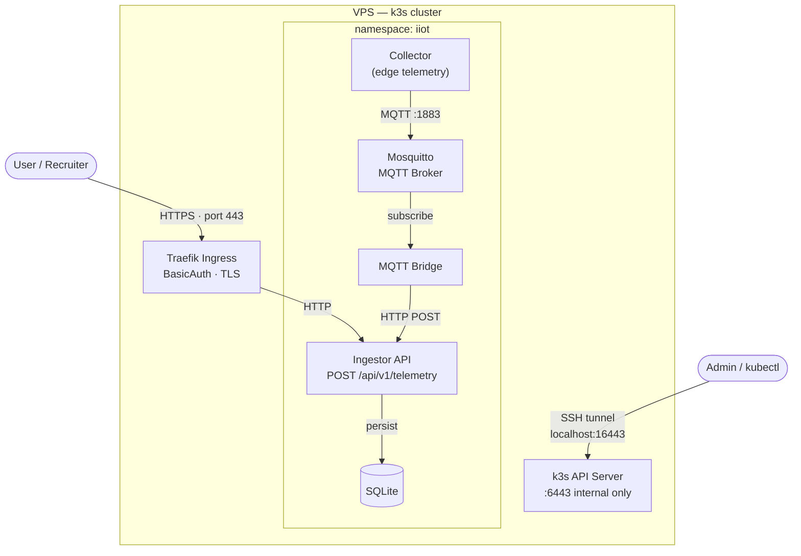

# IIoT Edge Platform

A lightweight Industrial IoT data pipeline built in Go, deployed on Kubernetes (k3s), and designed to survive production constraints — no domain, no managed cloud, no magic.

Sensor readings flow from a simulated field device → MQTT broker → bridge → HTTP ingestor → SQLite, all observable via Prometheus metrics and accessible through a Traefik ingress with BasicAuth and self-signed TLS.

> Contact: alimk1752@gmail.com

---

## Why I Built This

Most portfolio projects stop at "it runs locally." I wanted to build something that reflects
what DevOps and SRE work actually looks like: a service that is deployed, secured, observable,
and maintainable on real infrastructure.

This project runs a four-service IIoT telemetry pipeline on a self-managed k3s cluster with
Traefik ingress, BasicAuth, self-signed TLS, Prometheus metrics, SQLite persistence, and a
tag-triggered CI/CD pipeline. Cluster access is tunnelled through SSH — port 6443 is never
exposed. Operational runbooks, a maintenance guide, and a 30-second demo script are included
because shipping software is only half the job.

The goal was to demonstrate end-to-end thinking: from a `git tag` to a running pod, from a
curl returning 401 to one returning 200, and from a growing WAL file to a checkpointed database.

---

## Architecture

```
┌─────────────────────────────────────────────────────────┐
│                       EDGE / FIELD                       │
│                                                         │
│  ┌──────────────┐  simulated readings  ┌─────────────┐  │
│  │  Field Device│ ──────────────────► │  Collector  │  │
│  │ (PLC/Sensor) │                     │  (Go binary)│  │
│  └──────────────┘                     └──────┬──────┘  │
│                                              │ JSON/MQTT │
└──────────────────────────────────────────────┼──────────┘
                                               │
                                 ┌─────────────▼──────────┐
                                 │   Eclipse Mosquitto     │
                                 │   MQTT broker :1883     │
                                 └─────────────┬──────────┘
                                               │
                                 ┌─────────────▼──────────┐
                                 │   MQTT Bridge (Go)      │
                                 │   subscriber→forwarder  │
                                 └─────────────┬──────────┘
                                               │ HTTP POST
                                 ┌─────────────▼──────────┐
                                 │   Ingestor (Go)         │
                                 │   :8080 REST API        │
                                 │   :9091 Prometheus      │
                                 │   SQLite persistence    │
                                 └─────────────┬──────────┘
                                               │
                        ┌──────────────────────┼──────────────────────┐
                        │                      │                       │
              ┌─────────▼──────┐   ┌───────────▼──────┐   ┌──────────▼──────┐
              │ Traefik Ingress│   │  Prometheus/Grafana│   │  SQLite on PVC  │
              │ BasicAuth + TLS│   │  (metrics exposed) │   │  (5Gi RWO)      │
              └────────────────┘   └──────────────────┘   └────────────────┘
```

### High-Level Architecture

A four-service IIoT telemetry pipeline deployed on a single-node k3s cluster. Public
traffic enters through Traefik with BasicAuth and self-signed TLS. The data path runs
from a simulated edge collector through an MQTT broker to a REST ingestor that persists
readings to SQLite. The Kubernetes API is never exposed publicly — cluster management
requires an SSH tunnel.



### Components

| Component | Path | Role |
|-----------|------|------|
| `edge/collector` | Go binary | Publishes simulated sensor JSON to MQTT every 5s |
| `mosquitto` | Eclipse Mosquitto 2.0 | MQTT message bus, TCP 1883 |
| `cloud/mqtt-bridge` | Go binary | Subscribes to MQTT, POSTs to ingestor HTTP API |
| `cloud/ingestor` | Go binary | REST API — validates + stores telemetry; serves /healthz, /readyz, /metrics |
| Traefik | k3s bundled | Ingress controller, BasicAuth middleware, TLS termination |
| SQLite | `modernc.org/sqlite` | Zero-cgo embedded storage, WAL mode, 5Gi PVC |

### Ports

| Service | Port | Protocol | Purpose |
|---------|------|----------|---------|
| mosquitto | 1883 | TCP/MQTT | MQTT broker |
| collector | 9090 | HTTP | Prometheus metrics |
| ingestor | 8080 | HTTP | REST API |
| ingestor | 9091 | HTTP | Prometheus metrics |
| Traefik | 80/443 | HTTP/HTTPS | Public ingress |
| k3s API | 6443 | HTTPS | Cluster API (via SSH tunnel only) |

---

## How to Demo in 30 Seconds

### Recommended: SSH key auth (no password typing)

Copy your public key to the server once, then `make demo` just works:

```bash
# One-time: add your key to the server
ssh-copy-id -p 22 root@<SERVER_IP>

# Every run — no passwords needed
make demo
```

The script prompts interactively for the **BasicAuth password** (the one that gates the
app's HTTP endpoint). The script does not print it, store it, or pass it via environment.

### Alternative: password-based SSH

If key auth is not set up, the tunnel script falls back to a hidden interactive prompt.
Install `sshpass` first (it's used only to feed the password to SSH — never printed):

```bash
# macOS
brew install hudochenkov/sshpass/sshpass

# Then just run — you'll be prompted for SSH password, then BasicAuth password
make demo
```

### What the script does

1. Opens an SSH tunnel: `local 16443 → server 127.0.0.1:6443` (k3s API, not public)
2. Sets `KUBECONFIG=~/.kube/kubeconfig-iiot` — your default `~/.kube/config` is untouched
3. Prints a cluster snapshot: nodes, pods in `iiot`, ingress, Traefik service
4. Prompts for the BasicAuth password (hidden input, `read -s`)
5. Runs HTTP + HTTPS checks — expects `401` without auth, `200` with auth
6. POSTs a live telemetry reading through the public ingress

Expected output (no secrets shown):

```
══════════════════════════════════════════════
  STEP 1 — SSH tunnel to k3s API
══════════════════════════════════════════════
[tunnel-up] trying key auth...
[tunnel-up] tunnel ready (port 16443 open after 2 attempts)

  [nodes]
    NAME   STATUS   ROLES           AGE   VERSION
    iiot   Ready    control-plane   2d    v1.34.4+k3s1

  [pods — namespace: iiot]
    NAME                        READY   STATUS    RESTARTS
    collector-xxx               1/1     Running   0
    ingestor-xxx                1/1     Running   0
    mosquitto-xxx               1/1     Running   0
    mqtt-bridge-xxx             1/1     Running   0

  [PASS] GET /healthz   no-auth  → HTTP 401
  [PASS] GET /healthz   auth     → HTTP 200
  [PASS] GET /readyz    auth     → HTTP 200
  [PASS] POST /api/v1/telemetry  → HTTP 202  body: {"result":"accepted"}

══════════════════════════════════════════════
  DEMO OK — 7 checks passed, 0 failed
══════════════════════════════════════════════
```

### Getting the BasicAuth password

The password lives on the server only, never in git. To read it:

```bash
ssh root@<SERVER_IP> 'cat /opt/iiot/secrets/basic-auth-password.txt'
```

> **Security note:** Passwords are never passed via environment variables or
> command-line arguments — both are visible in `ps` output and shell history.
> `tunnel-up.sh` uses `sshpass -f <tmpfile>` to feed the password via a file
> descriptor that is deleted immediately after use. The BasicAuth password is
> read with `read -s` (no echo) and lives only in a local shell variable for
> the duration of the curl calls.

---

## Security Choices

### Why no real TLS certificate?

ACME/Let's Encrypt requires DNS validation (domain ownership). A bare IP address has no DNS delegation, so no public CA will sign a certificate for it. The demo uses a **self-signed cert with an IP SAN** — browsers warn, `curl -k` works, and it proves TLS termination is wired up correctly.

In production: add a domain → cert-manager + Let's Encrypt ClusterIssuer → automatic renewal.

### Why BasicAuth at the ingress?

It stops anonymous access before any traffic reaches application code. Traefik enforces it at the edge. For a demo this is proportionate and reversible. The password is bcrypt-hashed in the `iiot-basic-auth` Secret and never stored in git.

In production: replace with OIDC/OAuth2 (Traefik ForwardAuth + Keycloak/Dex).

### Why SSH tunnel for the Kubernetes API?

Port 6443 is **not** exposed publicly. The tunnel (`ssh -L 16443:127.0.0.1:6443`) forwards the API server through the encrypted SSH session only. This avoids the risk of a misconfigured firewall rule or exposed kubeconfig granting cluster access.

In production: VPN or bastion host with proper audit logging.

### Network isolation

All inter-service communication is ClusterIP (not NodePort). Only Traefik is reachable from the internet on ports 80/443 via the k3s `svclb` DaemonSet. The MQTT broker is cluster-internal.

---

## CI/CD

The release pipeline is tag-triggered:

```
git tag v1.2.3 && git push origin v1.2.3
         │
         └─► release.yml   — build + push images to GHCR
                 │
                 └─► deploy.yml  — kubectl set image + rollout status
```

### Release workflow

- Triggers on `v*` tags
- Builds `CGO_ENABLED=0` static Go binaries
- Produces distroless images (`gcr.io/distroless/static-debian12`)
- Pushes to GitHub Container Registry (`ghcr.io/<org>/iiot-edge-platform-golang/<service>:<tag>`)

### Deploy workflow

- Triggered by the same `v*` tag (runs after release)
- Requires `KUBECONFIG_BASE64` secret (base64-encoded kubeconfig with public IP substituted)
- Uses `kubectl set image` to update each deployment individually
- Waits for rollout via `kubectl rollout status --timeout`
- Probes `/healthz` and `/readyz` through a port-forward before marking success
- The `production` GitHub environment gate requires a reviewer to approve before deploying

### Rollback

```bash
# Roll back ingestor to the previous image
kubectl -n iiot rollout undo deployment/ingestor

# Or pin to a specific tag
kubectl -n iiot set image deployment/ingestor \
  ingestor=ghcr.io/<org>/iiot-edge-platform-golang/ingestor:v1.2.2
```

---

## Production vs Demo

| Concern | Demo (now) | Production |
|---------|-----------|------------|
| TLS | Self-signed, IP SAN | cert-manager + Let's Encrypt, domain |
| Auth | BasicAuth at ingress | OIDC/OAuth2 (Keycloak, Dex) |
| k8s API access | SSH tunnel | VPN or bastion + audit log |
| MQTT auth | Anonymous | TLS + password file or X.509 client certs |
| Storage | SQLite on emptyDir (ephemeral) / PVC (restart-durable) | TimescaleDB or InfluxDB on durable PV |
| Observability | Prometheus metrics exposed | Prometheus + Grafana + Alertmanager, PagerDuty |
| Ingestor replicas | 1 (RWO PVC, single writer) | Multi-replica with read replicas or distributed DB |
| Secret management | Manually generated on server | External Secrets Operator + Vault or cloud KMS |
| Rate limiting | None | Traefik `RateLimit` middleware |

---

## Troubleshooting

### SSH tunnel is down

```bash
# Check status
bash scripts/tunnel-up.sh --status

# Restart (will prompt for SSH password if key auth is not configured)
bash scripts/tunnel-up.sh

# Inspect tunnel logs (no secrets — password is never logged)
cat /tmp/iiot-tunnel.log
```

Set up key auth to avoid typing the SSH password every time:

```bash
ssh-copy-id -p 22 root@<SERVER_IP>
```

### Wrong kubectl context

The demo scripts set `KUBECONFIG=~/.kube/kubeconfig-iiot` — they never touch your default
`~/.kube/config`. If you run kubectl in a new shell without sourcing `kube-env.sh`, it will
use your default context.

```bash
source scripts/kube-env.sh   # sets KUBECONFIG for current shell
kubectl -n iiot get pods
```

### Getting 404 from the ingress (not 401)

The Traefik Middleware may not have been applied yet, or the ingress annotation is wrong.

```bash
# Check middleware exists
KUBECONFIG=~/.kube/kubeconfig-iiot kubectl -n iiot get middleware

# Check ingress annotations
KUBECONFIG=~/.kube/kubeconfig-iiot kubectl -n iiot describe ingress iiot-ingress
```

### Pod is CrashLooping

```bash
KUBECONFIG=~/.kube/kubeconfig-iiot kubectl -n iiot logs \
  -l app.kubernetes.io/name=ingestor --tail=50 --previous
```

### Getting 401 when you expect 200

The password you entered doesn't match the one in the Kubernetes Secret.
The secret is synced from `/opt/iiot/secrets/users` (htpasswd file). If you regenerated
the password on the server without re-syncing the Secret:

```bash
# On the server
kubectl -n iiot create secret generic iiot-basic-auth \
  --from-file=users=/opt/iiot/secrets/users \
  --dry-run=client -o yaml | kubectl apply -f -
```

---

## Local Development

```bash
# Full k3d local cluster (no server needed)
make k3d-up          # create cluster + load images + deploy

# After code changes
make k3d-redeploy    # rebuild + re-deploy without recreating cluster

# Integration tests
make k3d-e2e         # full end-to-end: POST → GET → metrics
make k3d-e2e-db      # SQLite persistence + query endpoints

# Compose (no Kubernetes, fastest start)
make compose-up
curl http://localhost:8080/healthz  # → {"status":"ok"}
```

See [docs/runbook.md](docs/runbook.md) for the full local workflow reference.

---

## Production Hardening Checklist

This demo runs as `root` with password SSH enabled — acceptable for a short-lived
demo server, but not for anything beyond that. Before treating this as production:

**Server access**
- [ ] Create a non-root service account: `useradd -m -s /bin/bash k8s-admin`
- [ ] Copy SSH keys to the new account; disable `root` SSH login (`PermitRootLogin no`)
- [ ] Disable SSH password authentication (`PasswordAuthentication no` in `sshd_config`)
- [ ] Restrict SSH to specific source IPs if known (`AllowUsers k8s-admin@<your-ip>`)

**Firewall**
- [ ] Open only ports 80, 443 (Traefik) and 22 (SSH) to the internet — block everything else
- [ ] Block port 6443 externally — the k3s API must never be publicly reachable
- [ ] Use `ufw` or `nftables` with a default-deny inbound policy

**Auth and secrets**
- [ ] Replace BasicAuth with OIDC/OAuth2 (Traefik ForwardAuth + Keycloak, Dex, or GitHub OAuth)
- [ ] Rotate the BasicAuth password and the self-signed TLS cert before any real use
- [ ] Move secrets to an external manager (Vault, AWS Secrets Manager, External Secrets Operator)

**TLS**
- [ ] Acquire a domain, point DNS to the server IP
- [ ] Install cert-manager with a Let's Encrypt ClusterIssuer
- [ ] Enable HSTS (`Strict-Transport-Security: max-age=31536000; includeSubDomains`)

**Observability**
- [ ] Add Grafana + Alertmanager on top of the existing Prometheus metrics
- [ ] Alert on `iiot_db_up == 0`, 5xx rate, and pod restart count
- [ ] Ship logs to a central store (Loki, CloudWatch, Datadog)

---

## SRE Takeaways

- **Distroless images** (`CGO_ENABLED=0` + `gcr.io/distroless/static-debian12`) eliminate shell, package manager, and most CVE surface. The tradeoff is no `exec` debugging — use ephemeral debug containers.
- **Separate liveness from readiness.** `/healthz` tells Kubernetes the process is alive; `/readyz` tells it the DB is ready to serve traffic. Conflating the two causes premature traffic routing after a restart.
- **WAL mode for SQLite under Kubernetes.** Single-writer, multi-reader semantics with `_busy_timeout=5000` prevents `SQLITE_BUSY` panics on burst traffic without introducing a full RDBMS.
- **`sessionAffinity: ClientIP`** routes a client's follow-up reads to the same pod as its write — necessary with an in-process cache and no distributed store.
- **Idempotent manifests with `--dry-run=client | kubectl apply -f -`** make secret rotation safe to re-run from any state.
- **SSH tunnel beats firewall holes.** Never open 6443 publicly. The tunnel provides encryption, authentication, and auditability for free.
- **Tag-triggered CI/CD with a `production` environment gate** prevents accidental deploys while keeping automation intact for deliberate releases.
- **IP-SAN self-signed cert** is the correct engineering answer when no domain exists — not skipping TLS entirely, not using cert-manager without DNS.
